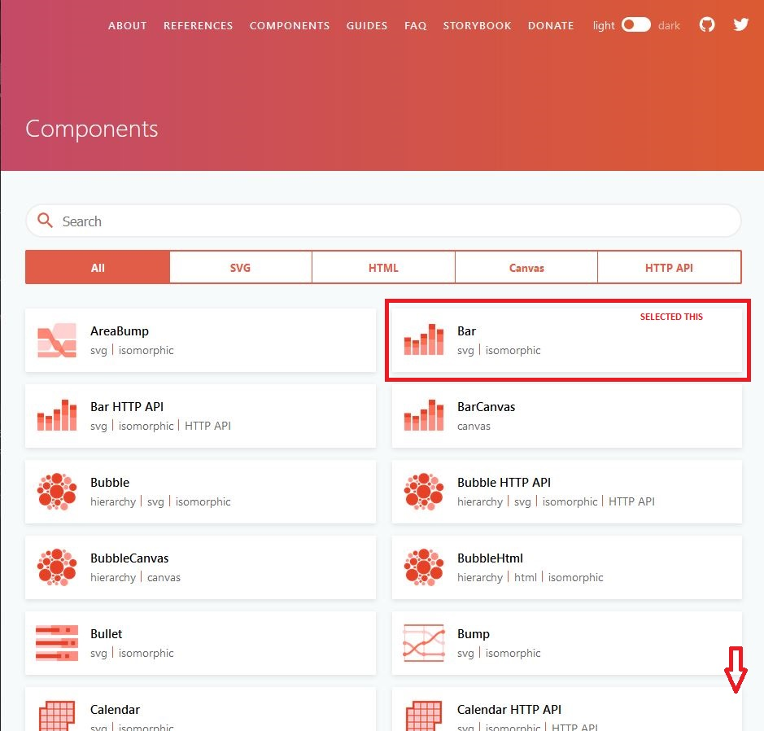
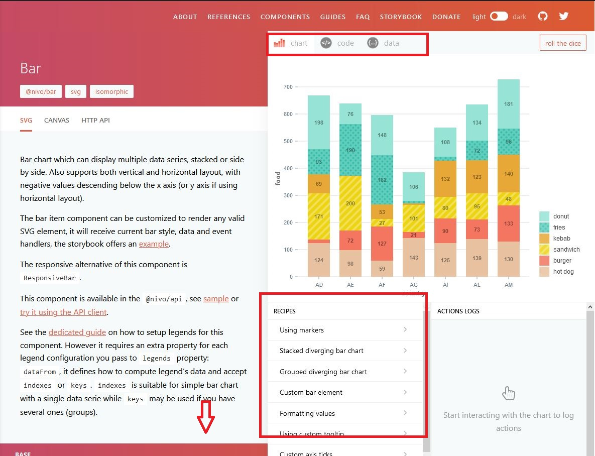
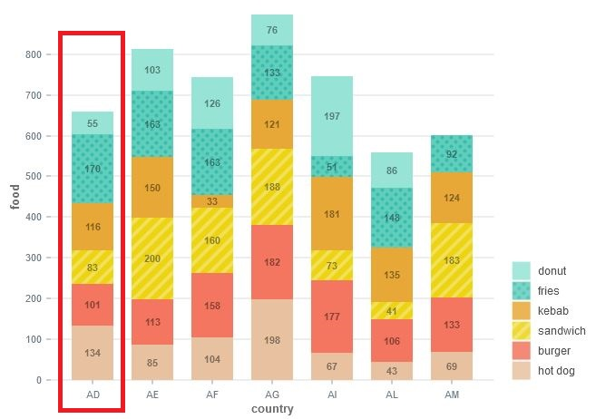

# Data Visualization

## Masters Course: Software Engineering

### Prof. Vala Ali Rohani

## Workshop ***Report***

---

## Dataviz library: **Nivo** for React.js

Nivo [website](https://nivo.rocks).

---

### Group 1

#### Composition

```text
André Ribeiro
    ::  200257016

Edna Martins
    ::  200257001

João Raimundo
    :: 200257008
```

---

## Index

1. Setup
   1.1. Node.js
   1.2. Yarn
   1.3. Code Editor (Visual Studio Code)
   1.4. Pre-prepared project (dataset included)
2. Nivo
   2.1. About
   2.2. Available Chart Types and the their learning curve
   2.3. How to use, example
   2.3.1. Accessing component documentation
   2.3.2 Select the desired component
   2.3.3 Analysing a component documentation and COPying the code

---

## 1. Setup

There is an array of software required in order to complete this workshop. We will list all the software requirements and demonstrate some installation steps the steps for instalations.

### 1.1. Installing Node.js

We will require Node.js 14.16 LTS or higher. The windows version can be downloaded from [this link](https://nodejs.org/en/download/). Just run the file and follow the instructions.

You check if the installation was successfull by running the following command:

```batch
node --version
```

Result:

> v14.16.0

### 1.2. Installing Yarn

With the Node.js installed open the command line and execute the following command:

```batch
npm install -g yarn
```

And check the installation by running:

```batch
yarn --version
```

Result:

> 1.22.10

### 1.3. Code Editor: Installing Visual Studio Code

We use Visual Studio Code. But any other editor and command line will do the job.

You can download the VSCode installation file from [here](https://code.visualstudio.com/download).

After successfull download just follow the installation download.

### 1.4. Downloading pre-prepared project

After installing all software, download the project from [here](https://github.com/Andree37/vi-nivo-proj/archive/refs/heads/main.zip) and unzip it to a local folder. Or clone the project from the Github Repo: [https://github.com/Andree37/vi-nivo-proj.git](https://github.com/Andree37/vi-nivo-proj.git).

### 1.5. Install project dependencies

Once you've downloaded the project you will finally need to install the project dependencies. Just open the project folder with Visual Studio Code (or other editor of your choice) and type in a command line:

```batch
yarn install
```

A large set of packages will be installed and afterwards you're good to go.

---

## 2. Nivo

### 2.1. About

Nivo is a library that provides "*Supercharged* React dataviz components" and it's built with both React and d3 Libraries.

Each chart is a component fully customizable in a declaritive fashion. As each chart is declared in a component and each component is a different file, the code is very clean and easy to customize for future requirememnts.

### 2.2. Available Chart Types and the their Learning Curve

Nivo provides an array of 54 different types of charts, graphs and maps each capable of provides for every need in terms of data vizualization. Altough it has so many different possibilities, Nivo has a very moderate learning curve. Not only beacuse all components follow the same declarative struture, but also because it is very *copy paste* friendly.

Actually the best way of using it is what we called SCOPID (Select COPy Inject Data)

That is:

1. Access documentation website, and ***Select*** the desired chart.
2. Press the *code* button and ***COPy*** it. Paste it in your code.
3. Format and ***Inject Data*** in the component.

### 2.3. How to use, example

#### 2.3.1. Accessing component documentation

To access Nivo documentation access this site [https://nivo.rocks/components]([www.gool](https://nivo.rocks/components)).

#### 2.3.2 Select the desired component

Search and/or scroll until you find the desired component. Lets checkout the *Bar chart*.



#### 2.3.3 Analysing a component documentation and COPying the code

As we select a component, we immediately vizualize an example of what the chart looks like. And right above it see that there are three tabs: chart, code, and data; defaulted to chart tab. And below we can see a list of recipes, usefull for selecting different configurations.



Pressing the code ***code tab*** we can see all the declaritive component configuration and parametrization. Well, just COPy and paste it in your project.

##### Example

```javascript
// install (please make sure versions match peerDependencies)
// yarn add @nivo/core @nivo/bar
import { ResponsiveBar } from '@nivo/bar'
// make sure parent container have a defined height when using
// responsive component, otherwise height will be 0 and
// no chart will be rendered.
// website examples showcase many properties,
// you'll often use just a few of them.
const MyResponsiveBar = ({ data /* see data tab */ }) => (
    <ResponsiveBar
        data={data}
        keys={[ 'hot dog', 'burger', 'sandwich', 'kebab', 'fries', 'donut' ]}
        indexBy="country"
        margin={{ top: 50, right: 130, bottom: 50, left: 60 }}
        padding={0.3}
        valueScale={{ type: 'linear' }}
        indexScale={{ type: 'band', round: true }}
        colors={{ scheme: 'nivo' }}
        defs={[
            {
                id: 'dots',
                type: 'patternDots',
                background: 'inherit',
                color: '#38bcb2',
                size: 4,
                padding: 1,
                stagger: true
            },
            {
                id: 'lines',
                type: 'patternLines',
                background: 'inherit',
                color: '#eed312',
                rotation: -45,
                lineWidth: 6,
                spacing: 10
            }
        ]}
        fill={[
            {
                match: {
                    id: 'fries'
                },
                id: 'dots'
            },
            {
                match: {
                    id: 'sandwich'
                },
                id: 'lines'
            }
        ]}
        borderColor={{ from: 'color', modifiers: [ [ 'darker', 1.6 ] ] }}
        axisTop={null}
        axisRight={null}
        axisBottom={{
            tickSize: 5,
            tickPadding: 5,
            tickRotation: 0,
            legend: 'country',
            legendPosition: 'middle',
            legendOffset: 32
        }}
        axisLeft={{
            tickSize: 5,
            tickPadding: 5,
            tickRotation: 0,
            legend: 'food',
            legendPosition: 'middle',
            legendOffset: -40
        }}
        labelSkipWidth={12}
        labelSkipHeight={12}
        labelTextColor={{ from: 'color', modifiers: [ [ 'darker', 1.6 ] ] }}
        legends={[
            {
                dataFrom: 'keys',
                anchor: 'bottom-right',
                direction: 'column',
                justify: false,
                translateX: 120,
                translateY: 0,
                itemsSpacing: 2,
                itemWidth: 100,
                itemHeight: 20,
                itemDirection: 'left-to-right',
                itemOpacity: 0.85,
                symbolSize: 20,
                effects: [
                    {
                        on: 'hover',
                        style: {
                            itemOpacity: 1
                        }
                    }
                ]
            }
        ]}
        animate={true}
        motionStiffness={90}
        motionDamping={15}
    />
)
```

And that represent all configurations possible for one component.

We're just missing the data.

#### 2.3.4. Injecting the Data

In the previous section we got our componenet config declaration, now the data. On the "data" tab, we can find an object like this:

```json
[
  {
    "country": "AD",
    "hot dog": 134,
    "hot dogColor": "hsl(348, 70%, 50%)",
    "burger": 101,
    "burgerColor": "hsl(245, 70%, 50%)",
    "sandwich": 83,
    "sandwichColor": "hsl(187, 70%, 50%)",
    "kebab": 116,
    "kebabColor": "hsl(268, 70%, 50%)",
    "fries": 170,
    "friesColor": "hsl(92, 70%, 50%)",
    "donut": 55,
    "donutColor": "hsl(51, 70%, 50%)"
  },
  (... continues ...)
]
```

Where each of these objects (rows if we think of a tabular format) represents one Bar. The first key (country) defines the column label. All the other, in pairs, represent the value and color of each stack. Producing the chart:



Now that we have both the code and the data format, we just need to put them together. On the code section we're we find the lines:

```javascript
data={data}
keys={['hot dog', 'burger', 'sandwich', 'kebab', 'fries', 'donut' ]}
```

On the first row we just need to pass the data object, and on the second row we just need to insert the legend keywords. And of course, all this can be done dynamically.

---

### Good luck with the workshop, enjoy ;)
